# Shards of Stone: 3D Asset Pipeline & Toolkit (`@shardsofstone/asset-toolkit`)

The open-source generative 3D asset pipeline behind [Shards of Stone](https://www.shardsofstone.com), for map makers, modders and custom game creators.

It takes a text prompt or a 2D concept to an animated, browser-ready 3D unit: a Gemini concept, a Meshy mesh, a rig (Meshy's humanoid auto-rig or headless Blender scripts), Mixamo or procedural clips, a player-colour dye mask, and a KTX2 + meshopt GLB for Three.js. Every step is a script you can read, run on its own and check.

## Video & Visual Showcase

### In-engine shoreline result (60 fps web engine)

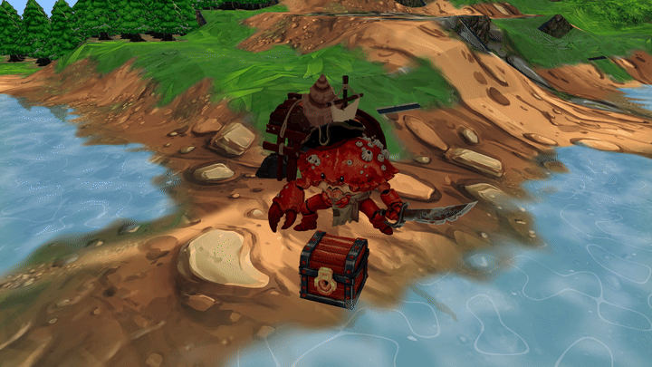

*The Shellback Cutthroat crab pirate running live in the Three.js web engine on a forest beach shoreline with dynamic water reflections, its creep spawner (the Shell Grotto), and treasure chest props.*

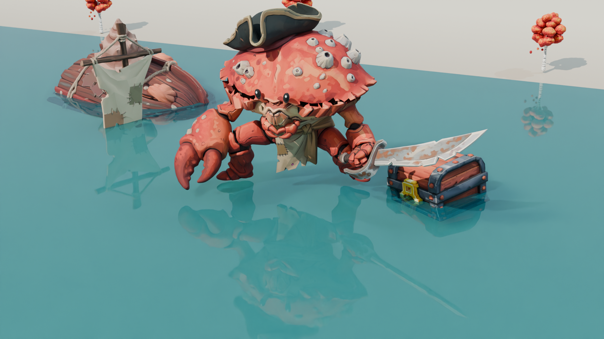

> **Video:** the full 60 fps video is in [`docs/videos/showcase_shellback_shoreline.mp4`](docs/videos/showcase_shellback_shoreline.mp4).

### The end-to-end pipeline

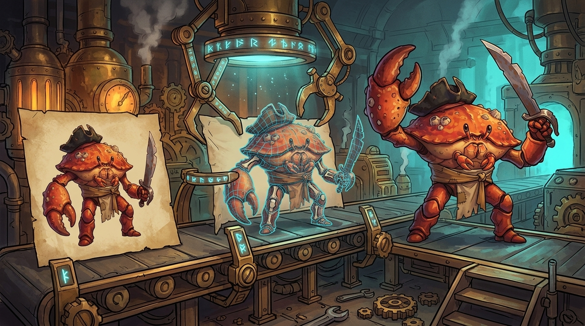

---

## Bundled example assets (test offline without API keys)

| Asset type | File path | Description |
|---|---|---|
| **Raw Meshy 3D mesh** | [`examples/models/cutthroat_raw_meshy.glb`](examples/models/cutthroat_raw_meshy.glb) | Unrigged 30,956-triangle sculpt straight from Meshy (the source mesh of the rig spec below) |
| **Rigged & animated 3D model** | [`examples/models/cutthroat_rigged_animated.glb`](examples/models/cutthroat_rigged_animated.glb) | The v3 rig: Meshy's 24-joint skeleton built in Blender, no faces deleted, five clips: `idle`, `walk`, `attack`, `attack_2`, `death` |
| **Humanoid rig and clip spec** | [`examples/anim-authoring/shellback_cutthroat.json`](examples/anim-authoring/shellback_cutthroat.json) | Joints, rigid regions with `grow` and `web`, Mixamo sources and clip polish for the model above |
| **More rig and clip specs** | [`examples/anim-authoring/`](examples/anim-authoring/) | Sword and shield, axe and shield, staff caster, archer, musket, mounted knight, goblin worker |
| **Critter profiles** | [`scripts/critter/profiles.json`](scripts/critter/profiles.json) | Arachnid, crustacean, scorpion, drake and sprawl body plans, including procedural stand-ins that need no mesh at all |
| **2D humanoid concept** | [`examples/concepts/shellback_cutthroat_concept.png`](examples/concepts/shellback_cutthroat_concept.png) | Clean studio-isolated concept of the crab pirate |
| **2D critter concept** | [`examples/concepts/reef_crab_concept.png`](examples/concepts/reef_crab_concept.png) | Concept of the reef crab (six walking legs, two claws) |
| **VAT file layout sample** | [`examples/vat/`](examples/vat/) | Mesh, position/normal KTX2 and metadata of an experimental VAT bake. A single rest-pose frame: it shows the file layout, not an animation |

### Quick offline tests

```bash
# Rig the bundled raw mesh in Blender from its spec (checks the boundary-edge assertion)
node bin/shards-asset.mjs rig-humanoid \
  --spec examples/anim-authoring/shellback_cutthroat.json \
  --out ./output/anim-authoring/shellback_cutthroat/rig-v3/character.glb

# Render review frames of the bundled animated model, then a contact sheet
node bin/shards-asset.mjs clip-review \
  --input examples/models/cutthroat_rigged_animated.glb \
  --output-dir ./output/review/cutthroat --samples 8
python3 scripts/clip_review_sheet.py --review-dir ./output/review/cutthroat \
  --out ./output/review/cutthroat_sheet.png --gameplay-px 48

# Build, rig and animate a procedural spider stand-in (no mesh, no API keys)
node bin/shards-asset.mjs rig-critter standin --kind spider --out output/standins/spider.glb
node bin/shards-asset.mjs rig-critter prep spider_standin
node bin/shards-asset.mjs rig-critter fit spider_standin
node bin/shards-asset.mjs rig-critter all spider_standin v1

# Optimise the bundled animated model for the browser
node bin/shards-asset.mjs optimize \
  --input examples/models/cutthroat_rigged_animated.glb \
  --output ./output/optimized_cutthroat.glb
```

Note: `rig-critter fit` writes the fitted joints back into the profile file. Point `CRITTER_PROFILES` at a copy of `scripts/critter/profiles.json` to keep the repo's copy untouched.

---

## What this toolchain does

1. **Concept generation and clean-up:** isometric 3/4 concepts from Gemini, with atmospheric effects (smoke, embers, ground pedestals) stripped because 3D generators sculpt them into solid lumps. Optional T-pose and player-colour key colours.
2. **3D mesh generation:** Meshy image-to-3D turns the concept into a ~30,000-polygon textured GLB.
3. **Rigging and skinning:**
   - **Humanoids:** Meshy's humanoid auto-rig, then fix-ups in Blender (weapon 100% to the hand, shield, tail, skirt and cloak). When Meshy refuses a body (a crab-folk with its head fused into the shell), `rig-humanoid` builds the same 24-joint skeleton in Blender instead.
   - **Mounts:** `rig-mount` rigs a rider on a horse as one skinned model with two skeletons.
   - **Critters:** `rig-critter` traces every leg, claw and tail from its tip, labels each limb, confines heat weights to their own limb, and authors procedural gaits.
4. **Clips:** Mixamo FBX clips retargeted onto the 24-joint humanoid (with mirroring and stance retention), then trimmed, sped, damped and fitted to props by `polish-clips`. Critters get procedural idle, walk, attack, death and special clips.
5. **Player colour:** `dye-mask` turns magenta and cyan zones painted in the Meshy input into a one-channel mask the game tints per player.
6. **Browser optimisation:** textures resized to 1024 px and transcoded to KTX2, geometry compressed with meshopt.
7. **VAT (experimental):** a baker that stores animation in a texture. The game does not use this path today.

---

## Toolchain requirements

| Requirement | Supported versions | Notes |
|---|---|---|
| **Node.js** | `>= 20.6.0` | The CLI, Meshy/Gemini clients, dye mask |
| **Blender** | `4.2+` or `5.x` | Every rigging, clip and review step runs headless |
| **Python** | `>= 3.10` with `numpy`, `scipy`, `Pillow` | Critter fitting (`fit_arthropod.py`), label renders and contact sheets. Blender's own Python covers the Blender scripts |
| **glTF-Transform CLI** | `^4.0.0` | Installed as a dev dependency; used by `optimize` |
| **KTX-Software** (`ktx`) | `4.x` | Needed by `optimize` for KTX2 textures; without it `optimize` falls back to meshopt only |
| **ffmpeg** | any | Optional: the critter review video |

```bash
git clone https://github.com/AdamJSturrock/shards-asset-toolkit.git
cd shards-asset-toolkit
npm install
python3 -m pip install numpy scipy pillow

# Blender on your PATH, or set BLENDER_PATH in .env
export PATH="/Applications/Blender.app/Contents/MacOS:$PATH"   # macOS
```

## API keys & services

1. **Google Gemini (`GEMINI_API_KEY`):** concept images. [Google AI Studio](https://aistudio.google.com/).
2. **Meshy (`MESHY_API_KEY`):** image-to-3D meshes and the humanoid auto-rig. [meshy.ai](https://www.meshy.ai/).
3. **Mixamo account (free):** humanoid clips, downloaded as FBX "without skin". [mixamo.com](https://www.mixamo.com).
4. **Anthropic (`ANTHROPIC_API_KEY`, optional):** only if you drive the Blender steps with a coding agent. The scripts do not call it.

```bash
cp .env.example .env   # then fill in your keys
```

## What it costs

Measured prices only. Retries, rejected meshes and agent tokens depend on the unit and are not included.

| Stage | Service | Cost |
|---|---|---|
| Concept image | Gemini 3 Pro Image | about $0.134 per image |
| 3D mesh | Meshy image-to-3D | 30 credits |
| Humanoid auto-rig | Meshy rigging (no animations) | 5 credits |
| Rigging, clips, review, dye mask, optimisation | Blender, Mixamo, glTF-Transform, local Node | free (local) |

`node bin/shards-asset.mjs estimate-cost --units 10 --candidates 3` prints the same for a batch; pass `--usd-per-credit` to convert Meshy credits at your plan's rate.

---

## Commands

Every command prints its options with `--help`. Commands marked **Blender** forward their arguments to one script, run as `blender -b --factory-startup --python-exit-code 1 --python <script> -- <args>`; their `--help` prints the script's own documentation.

| Command | Script | What it does |
|---|---|---|
| `concept` | [`src/concept.mjs`](src/concept.mjs) | Gemini concept. `--tpose` for rigging, `--key-colours` for the dye mask |
| `mesh` | [`src/mesh.mjs`](src/mesh.mjs) | Meshy image-to-3D. `--ai-model`, `--pose-mode`, `--symmetry`, `--polycount` |
| `meshy-rig` | [`src/meshy_rig.mjs`](src/meshy_rig.mjs) | Meshy humanoid auto-rig of a mesh task (5 credits) |
| `rig-humanoid` (Blender) | [`scripts/blender/rig_humanoid.py`](scripts/blender/rig_humanoid.py) | Meshy's 24-joint skeleton built in Blender from a spec, for bodies Meshy refuses. Rigid regions, `grow`, `web`, boundary-edge assertion |
| `rig-fixup` (Blender) | [`scripts/blender/rig_fixup.py`](scripts/blender/rig_fixup.py) | Fix a Meshy auto-rig: weapon 100% to the hand, rigid regions, skirt and cloak weights, tail chain, separate shield prop |
| `rig-mount` (Blender) | [`scripts/blender/rig_mount.py`](scripts/blender/rig_mount.py) | Horse and rider as one skinned GLB (quadruped mount + 24-joint rider) |
| `mount-clips` (Blender) | [`scripts/blender/mount_clips.py`](scripts/blender/mount_clips.py) | Procedural mount gaits with the retargeted rider, one action per clip |
| `repair-head-weights` (Blender) | [`scripts/blender/repair_head_weights.py`](scripts/blender/repair_head_weights.py) | Strip the shoulder weight Meshy leaks into the head |
| `retarget-mixamo` | [`scripts/blender/retarget_mixamo.py`](scripts/blender/retarget_mixamo.py) | Mixamo FBX clips onto the 24-joint humanoid. `--mirror`, `--loop`, `--leg-align` |
| `polish-clips` (Blender) | [`scripts/blender/polish_clips.py`](scripts/blender/polish_clips.py) | Candidate clips into the final set: range, speed, loop seams, yaw, bone damping, ground clamp, markers, `twoHandProp`, `uprightProp`, `recoil`, `secondary` |
| `clip-review` (Blender) | [`scripts/blender/clip_review.py`](scripts/blender/clip_review.py) | Sampled frames of every clip from the game view, side and front. [`scripts/clip_review_sheet.py`](scripts/clip_review_sheet.py) makes the contact sheet, with a gameplay-size row |
| `rig-pose-check` (Blender) | [`scripts/blender/rig_pose_check.py`](scripts/blender/rig_pose_check.py) | Stress poses (arms raised, crouch, twist) that expose bad weights |
| `weight-review` (Blender) | [`scripts/blender/meshy_rig_weight_review.py`](scripts/blender/meshy_rig_weight_review.py) | Paints each vertex by its dominant bone group: shows where Meshy put the weapon's weight |
| `rig-critter` | [`scripts/critter/`](scripts/critter/) | Critter pipeline: `standin`, `prep`, `fit`, `rig`, `review`, `check`, `add-limb`, `all` |
| `dye-mask` | [`src/dye_mask.mjs`](src/dye_mask.mjs) | Player-colour mask: `apply`, `bbox`, `verify` |
| `optimize` | [`src/optimize.mjs`](src/optimize.mjs) | KTX2 textures, meshopt geometry |
| `bake-vat` | [`scripts/blender/vat_bake.py`](scripts/blender/vat_bake.py) | Experimental VAT bake |
| `estimate-cost` | [`src/pricing.mjs`](src/pricing.mjs) | Credits and image cost for a batch |
| `pipeline` | [`src/pipeline.mjs`](src/pipeline.mjs) | Concept, mesh, rig, retarget, dye mask, optimise from one JSON config ([`examples/units/`](examples/units/)) |

Critter scripts that have no subcommand of their own run directly: `python3 scripts/critter/trace_legs.py`, `python3 scripts/critter/auto_joints.py` (quadrupeds), and in Blender `scripts/critter/render_compare.py` and `scripts/critter/diag_ground.py`. Each file's docstring gives its command line.

---

## Step by step

### Stage 1: concept

| Shellback Cutthroat (Humanoid) | Reef Crab (Critter) |
|---|---|
| 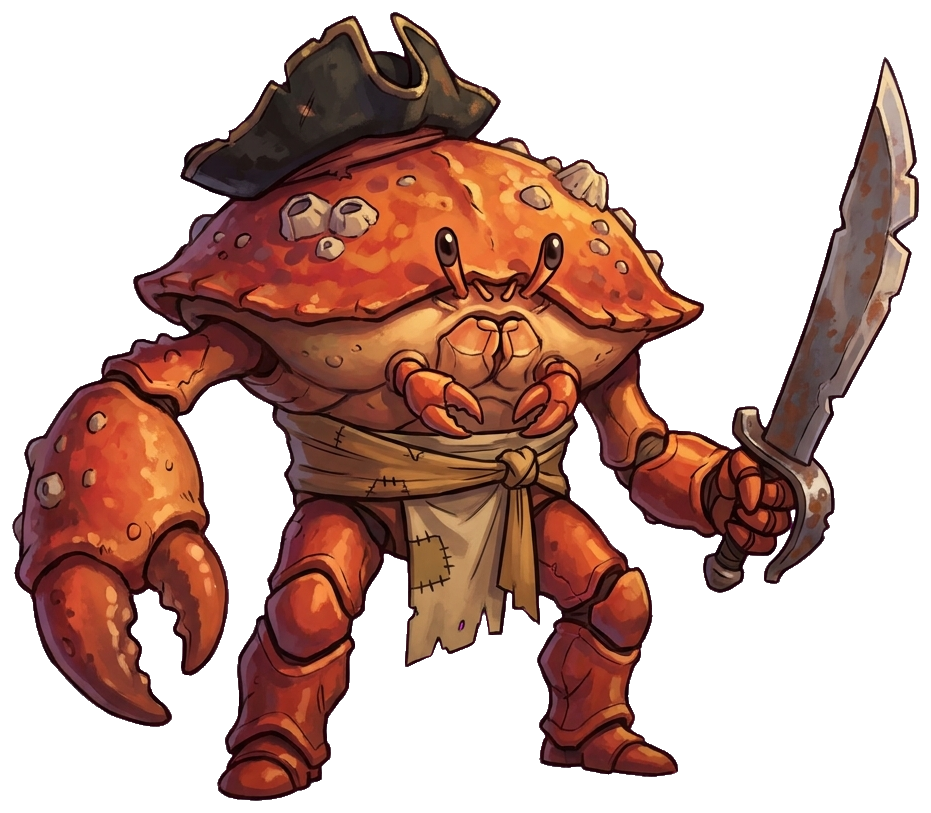 | 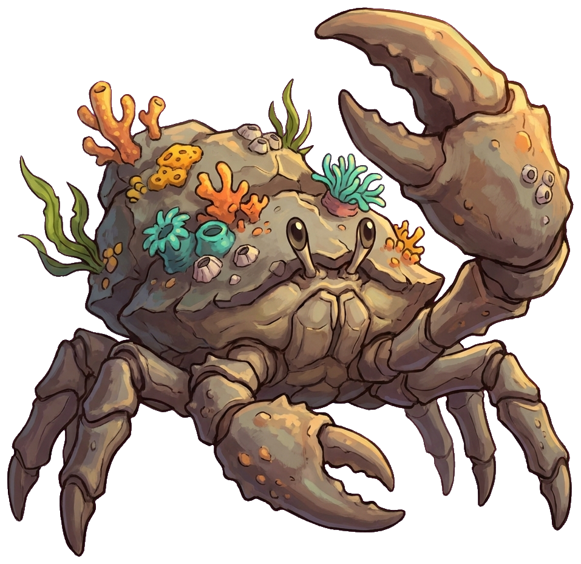 |

```bash
node bin/shards-asset.mjs concept \
  --prompt "An upright crab-folk buccaneer pirate, barnacled shell, tricorn hat, huge right claw, cutlass in left claw" \
  --output ./output/concepts/shellback_cutthroat.png
```

Strip particles, smoke, embers and ground shadows: 3D generators have no idea of transparency and sculpt them into solid geometry. For an armed humanoid that Meshy will auto-rig, add `--tpose`; for player colour, add `--key-colours`.

### Stage 2: Meshy mesh

| Shellback Cutthroat 3D Mesh | Reef Crab 3D Mesh |
|---|---|
| 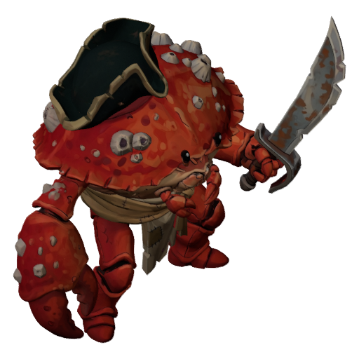 | 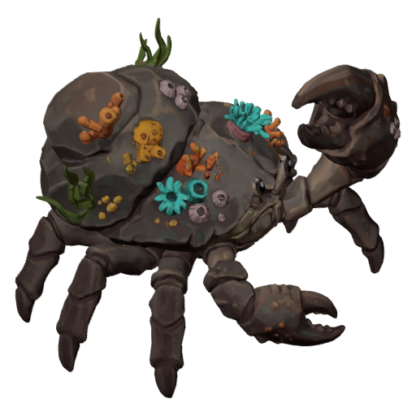 |

```bash
node bin/shards-asset.mjs mesh \
  --input ./output/concepts/shellback_cutthroat.png \
  --output ./output/meshes/shellback_cutthroat.glb \
  --polycount 30000
```

This writes `shellback_cutthroat.meshy.json` next to the GLB, with the task id `meshy-rig` needs. Leave `--pose-mode` off for armed characters (see [Lessons](#lessons-and-pitfalls)). `--symmetry on` helps a bilateral creature drawn in 3/4 view, whose hidden side otherwise comes back with fewer legs.

### Stage 3: rig

| Humanoid 24-joint rig | Reef crab: six walking legs and two claws |
|---|---|
| 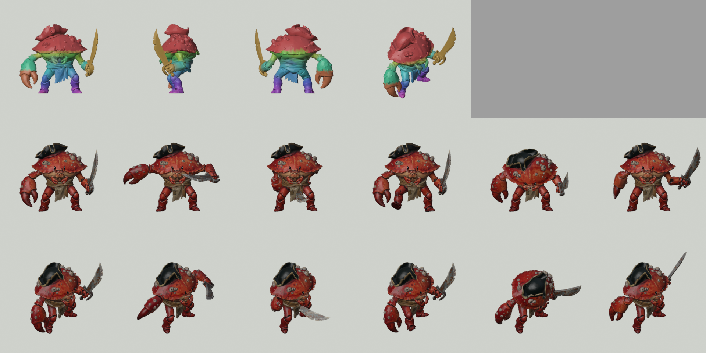 | 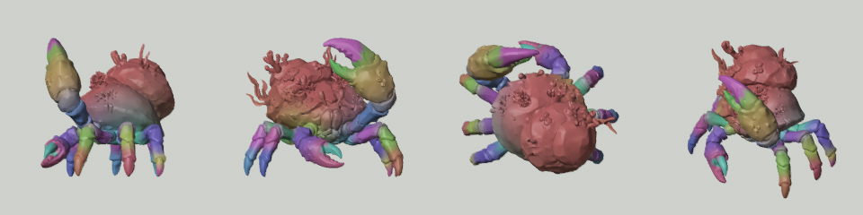 |

**A humanoid Meshy can rig:**

```bash
node bin/shards-asset.mjs meshy-rig --task-json ./output/meshes/unit.meshy.json --output ./input/unit/rigged.glb --height 1.7
node bin/shards-asset.mjs weight-review targets.json          # where did Meshy put the weapon?
node bin/shards-asset.mjs rig-fixup --spec examples/anim-authoring/dwarf_axe_shield.json \
  --out ./output/anim-authoring/dwarf_axe_shield/rig-v1/rig.glb
node bin/shards-asset.mjs rig-pose-check --input ./output/anim-authoring/dwarf_axe_shield/rig-v1/rig.glb \
  --out ./output/anim-authoring/dwarf_axe_shield/rigcheck.png
```

**A humanoid Meshy refuses** ("Pose estimation failed", not charged): write a `rigBuild` spec with the joint positions and rigid regions, then

```bash
node bin/shards-asset.mjs rig-humanoid --spec examples/anim-authoring/shellback_cutthroat.json \
  --out ./output/anim-authoring/shellback_cutthroat/rig-v3/character.glb
```

The report (`character.json`) lists per-bone vertex counts, the regions, how many vertices `grow` added and `web` blended, and the welded boundary-edge count of the source and the rig. For the cutthroat both are 31.

**A critter:**

```bash
node bin/shards-asset.mjs rig-critter prep reef_crab --input ./input/reef_crab.glb
node bin/shards-asset.mjs rig-critter fit reef_crab        # LOOK at labels.png and fit.png
node bin/shards-asset.mjs rig-critter all reef_crab v1
```

`fit` traces every limb from its tip along the surface, labels each vertex with its limb and runs the label checks (each limb one connected piece, mirror pairs of similar size, no two limbs sharing an edge, every tip inside its label, one connected body). Labels run all the way to the body wall (`extend_to_core`), so a claw's upper segments stay with the claw. A failed check stops the step before anything is rigged. If Meshy dropped a leg, `rig-critter add-limb` copies a labelled one.

### Stage 4: clips

```bash
node bin/shards-asset.mjs retarget-mixamo --target ./output/anim-authoring/shellback_cutthroat/rig-v3/character.glb \
  --clip idle_axe=mocap/idle_with_axe.fbx --clip slash_sns=mocap/sword_and_shield_slash.fbx \
  --loop idle_axe --mirror idle_axe --mirror slash_sns --leg-align 0.3 \
  --out ./output/anim-authoring/shellback_cutthroat/candidates-v2/candidates.glb
node bin/shards-asset.mjs polish-clips --spec examples/anim-authoring/shellback_cutthroat.json \
  --out ./output/anim-authoring/shellback_cutthroat/v3/character.glb
node bin/shards-asset.mjs clip-review --input ./output/anim-authoring/shellback_cutthroat/v3/character.glb \
  --output-dir ./output/anim-authoring/shellback_cutthroat/v3/review
```

Skip `repair-head-weights` on a `rig-humanoid` rig that uses a `web`: the repair strips arm influence from every vertex with some Head weight, which flattens the web's gradient back into a hard seam.

#### Shellback Cutthroat clips

| Idle (1.83 s) | Walk (1.43 s) | Cutlass slash, `attack` (1.00 s) | Claw strike, `attack_2` (0.97 s) | Death (3.17 s) |
|:---:|:---:|:---:|:---:|:---:|
| 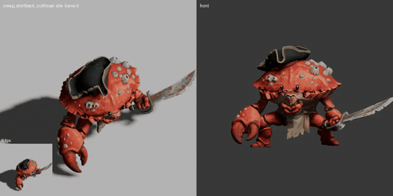 | 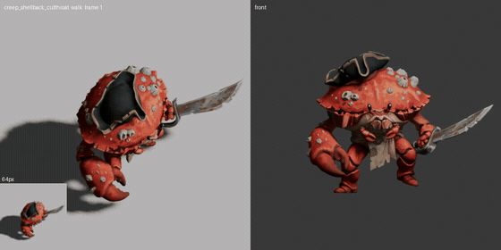 | 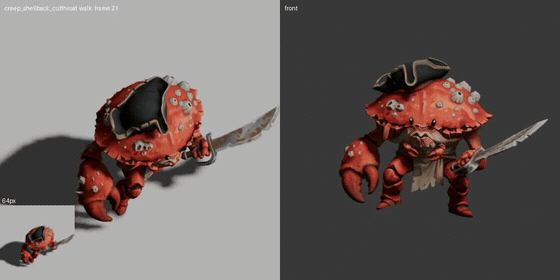 | 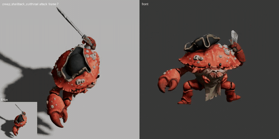 | 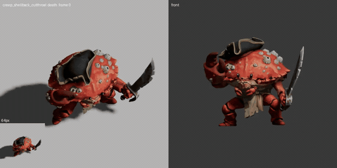 |

#### Critter gaits

| Reef crab (six walking legs, two claws) | Broodspider (eight legs) |
|:---:|:---:|
| 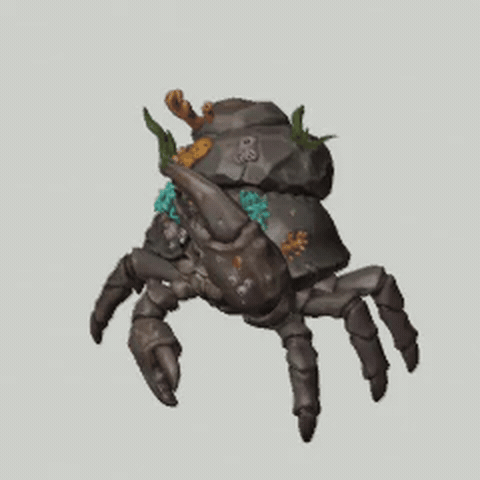 | 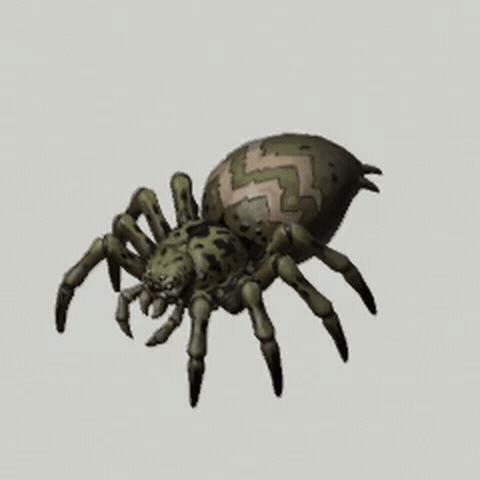 |

### Stage 5: player colour

Paint accent zones (banners, plumes, sashes) pure magenta `#FF00FF` and large cloth (a cloak, a caparison) pure cyan `#00FFFF` in the image you give Meshy (`concept --key-colours` asks Gemini to). After the last Blender pass:

```bash
node bin/shards-asset.mjs dye-mask apply --in animated.glb --out animated.dyed.glb --review dye_review.png
node bin/shards-asset.mjs dye-mask verify animated.dyed.glb
```

The mask goes into the glTF **occlusion** slot as **one channel** with three levels: 0 no dye, 0.5 extended, 1 accent. It must be one channel because KTX2 stores an occlusion texture as R-only. The keyed texels are repainted in a default colour, so the unit still looks right where no player colour applies. Any Blender re-export afterwards drops the mask: run `verify` after every later step. Existing art without key colours takes hue or luma rules (`--rules`, see [`src/dye_mask.mjs`](src/dye_mask.mjs)).

### Stage 6: optimise

```bash
node bin/shards-asset.mjs optimize --input animated.dyed.glb --output character.glb --texture-max 1024
```

### Stage 7: in engine


---

## Weapon classes

| Weapon class | Clip source | Grip and constraint rule |
|---|---|---|
| **Sword and shield** | Mixamo sword-and-shield pack (idle, slashes, block). `--mirror` for a left-handed unit | Sword 100% to the hand (`rig-fixup` `weapons`). The shield is a separate Meshy prop, attached rigid to the forearm (`rig-fixup` `shield`). Grip roll: known issue, below. Example: [`human_sword_shield.json`](examples/anim-authoring/human_sword_shield.json) |
| **One-hand axe or mace** | Mixamo axe clips, or the sword-and-shield one-hand attacks | Head and haft 100% to the hand; the fist keeps Meshy's weights. Grip roll: known issue. Example: [`dwarf_axe_shield.json`](examples/anim-authoring/dwarf_axe_shield.json) |
| **Flail** | Mixamo one-hand attacks | Handle 100% to the hand. The chain and head need their own bone chain with secondary motion (what `polish-clips` `secondary` does for a tail). Not yet built for flails |
| **Two-hand polearm** | Mixamo two-hand weapon clips | Haft 100% to the lead hand; the off hand needs IK on the haft. `polish-clips` `twoHandProp` does this for a musket held across the chest ([`shellback_gunner.json`](examples/anim-authoring/shellback_gunner.json)); not yet validated on a polearm |
| **Bow** | Mixamo archery clips (draw, aim, release) | Bow 100% to the bow hand. The string needs a nock bone that follows the drawing hand: not yet in the toolkit ([`elf_archer.json`](examples/anim-authoring/elf_archer.json) rigs the bow hand and cloak only) |
| **Staff caster** | Mixamo spellcast clips | Staff 100% to the hand; `polish-clips` `uprightProp` keeps it within `maxTilt` of vertical so a cast never swings the orb down ([`elf_staff_mage.json`](examples/anim-authoring/elf_staff_mage.json)) |

---

## Lessons and pitfalls

- **Meshy `pose_mode: t-pose` drops held weapons.** Meshy re-poses the character into its own T-pose with open, flat hands and silently removes whatever it holds (seen on an axe-wielding dwarf). For armed humanoids, feed T-pose concept art and leave pose mode off: Meshy's auto-rig still accepts it. Then weight the held weapon 100% to the hand bone (`rig-fixup`), because Meshy smears weapon weights onto the forearm or upper arm (`weight-review` shows it).
- **Never delete geometry to free a part for rigging.** Meshy fuses touching parts into one shell. The first Shellback Cutthroat rig cut the fused "web" faces between the shell rim and the face and arms, and left see-through holes: welded boundary edges went from 31 in the source to 347. The fix keeps the mesh intact:
  - the whole carapace, rim underside included, is rigid to `Head` (a `grow` region);
  - the fused skin gets a short harmonic weight gradient (a `web` falloff of about 0.1 m, like a shoulder);
  - the export **asserts** that the rigged mesh's welded boundary-edge count is no higher than the source's.

  Result: 31 boundary edges, the same as the source, and far less stretching. The old `detachFrom` and `detachPairs` options now raise an error.
- **Weapon grip (known issue, fix in progress).** T-pose art with the weapon drawn upright gives a thumb-up fist, but Mixamo's rest pose is a palm-down fist with the blade pointing forward. Retargeted clips then carry a roll offset of about 90 degrees and swords look held wrong. The planned fix is a grip normalise at rest; until it lands, check held weapons in `clip-review`. Two-handed polearms also need off-hand IK on the haft, and bows need a bowstring nock bone that follows the drawing hand.
- **Look at the renders.** Every rig and clip step writes numbers (vertex counts, seam errors, boundary edges); they are evidence, not approval. Use `rig-pose-check`, `clip-review`, the critter `labels.png` and the contact sheet's gameplay-size row.
- **Blender reads clips at the scene frame rate.** The glTF importer converts seconds to frames at the scene rate, and Blender's factory default is 24 fps; the scripts set 30 fps before importing. Do the same in your own scripts, or every clip silently shortens.
- **A Blender re-export drops glTF extras**, including the dye mask. Run `dye-mask` after the last Blender pass and `dye-mask verify` after anything else.
- **Critter hint coordinates belong to one mesh.** The profiles' `fit` hints were read off the fit grid for the meshes they were made for; a new Meshy mesh needs its own.

---

## Deep dive: browser optimisation

When an RTS runs in a browser on WebGL2:
1. **Texture memory:** a PNG or JPEG is decoded into uncompressed RGBA in GPU memory, so a 2048 px texture takes 16 MB. KTX2 (Basis Universal) stays compressed on the GPU.
2. **Shader sampler limits:** WebGL2 guarantees only 16 texture units per shader, and the Shards of Stone terrain shader already uses all 16. Keep unit materials compact: the dye mask reuses the occlusion slot rather than adding a texture.

KTX2 codecs: **UASTC** for normal and roughness maps (fewer artefacts on normals), **ETC1S** for base colour and emissive (smaller).

**meshopt rather than Draco:** Draco compresses slightly better on disk but needs a heavy WebAssembly decoder; `EXT_meshopt_compression` decodes almost instantly.

### Vertex Animation Textures (experimental)

`bake-vat` samples every vertex on every frame of every clip into 16-bit position and normal textures, so a vertex shader can animate instanced copies without a skeleton. **The Shards of Stone game does not use this path today:** units render as skinned GLBs with standard GPU skinning plus instancing. The baker works, but no in-game frame-time or memory numbers have been measured for it.

---

## Experimental: reference-to-video with Seedance for complex motion and VFX

Procedural gaits and Mixamo retargeting cover locomotion and standard attacks. For bespoke choreography and effects we are testing Blender proxy blocking combined with ByteDance's **Seedance** video model:

```
[ 3D Proxy / Viewport Previs ] ──► [ Playblast Reference Video ]
                                               │
                                               ▼
                                 [ Seedance R2V Diffusion ]
                                    (Guided by 3D timing)
                                               │
                         ┌─────────────────────┴─────────────────────┐
                         ▼                                           ▼
            [ Motion Delta Tracking ]                    [ Synchronised VFX ]
         (Pose estimation to keyframes)               (Impact sprites & shaders)
                         │                                           │
                         ▼                                           ▼
            [ Blender Armature Action ]                  [ Engine Particle / Mesh ]
```

1. **Proxy blocking:** the model or proxy geometry is animated in Blender with rough keys for camera, timing and trajectory.
2. **Playblast:** Blender renders a lightweight viewport video.
3. **Reference-to-video:** the playblast guides Seedance, alongside character and scene prompts.
4. **Motion back to the rig:** pose tracking turns the generated frames back into joint rotations.
5. **VFX extraction:** splashes, halos and shockwaves become alpha-masked sprite sheets or particles timed to the hit window.

> This is research, not a CLI command.

---

## Using a unit in Shards of Stone

1. Copy the optimised GLB into your mod package:
   ```
   my-custom-map.sosmod/
     assets/
       models/neutral/units/reef_crab/character.glb
   ```
2. Reference it from your custom unit definitions (`customUnits.json`):
   ```json
   {
     "id": "custom_reef_crab",
     "name": "Reef Crab",
     "race": "neutral",
     "modelId": "reef_crab",
     "stats": { "hp": 450, "damage": 22, "armor": 5, "speed": 2.4 }
   }
   ```
   **A 3D model without a matching `modelId` on its unit definition does not render:** the engine falls back to the 2D sprite.

Clip names follow the game's aliases: `idle`, `walk`, `attack`, `attack_2`, `death`, plus `special_1..3` for abilities. Don't name a clip `sit`: the runtime substring-matches aliases.

---

## Contributing & licence

MIT, see [LICENSE](LICENSE). Body-plan templates, retargeting presets, weapon-class specs and fixes are welcome.

- Issues: [GitHub Issues](https://github.com/AdamJSturrock/shards-asset-toolkit/issues)
- Game: [shardsofstone.com](https://www.shardsofstone.com)
- Modding docs: [shardsofstone.com/docs](https://www.shardsofstone.com/docs)
